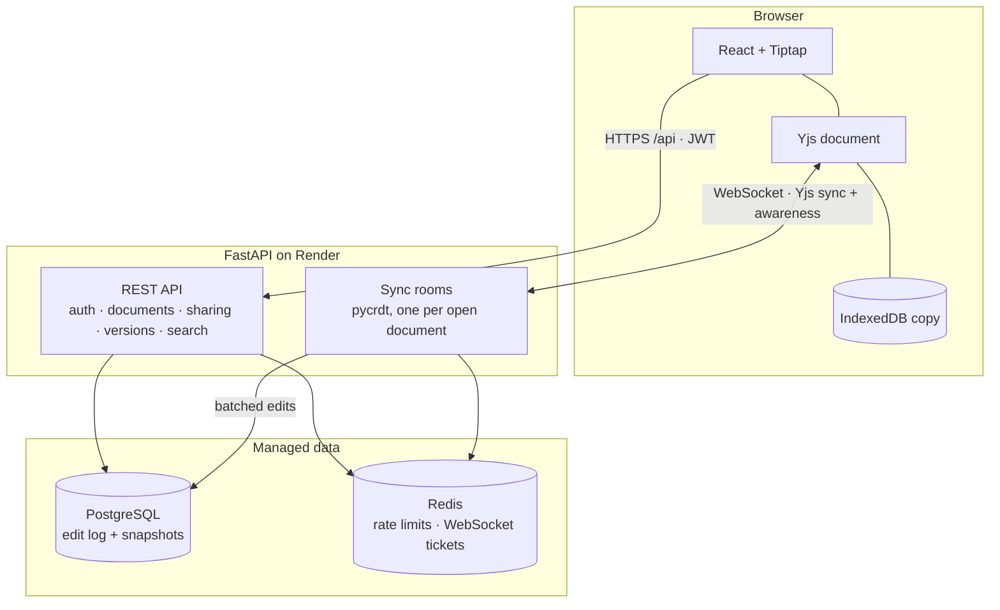

# CollabEdit

Real-time collaborative documents, in the spirit of Google Docs: live cursors, offline editing,
version history, full-text search and link sharing — on a sync server, storage layer and auth
system written from scratch. And something Google Docs lacks: Git-style branches, so you can fork
a live document, rework it on the side, and merge it back after review.

[](https://github.com/Aditya-XR/collaborative-editor/actions/workflows/ci.yml)
&nbsp;**[Live demo](https://collaborative-editor-flax.vercel.app)** · [Plan and progress](docs/PLAN.md) ·
[Architecture decisions](docs/adr) · [Deployment](docs/DEPLOY.md)


> **Status:** live on Vercel (web) and Render (API) with Neon Postgres and Redis Cloud. Phases 0–4
> and 7 of the [v2 plan](docs/PLAN.md) are done — accounts, live editing with offline support,
> compaction, version history, search, sharing, and branches with merge requests. Still to come:
> comments, multi-instance Redis. The original MERN version is preserved under the
> [`v1` tag](https://github.com/Aditya-XR/collaborative-editor/tree/v1).
>
> The free API instance is kept awake 08:00–24:00 IST; outside those hours the first request can
> take up to a minute while it wakes.

## Highlights

- **Own sync server.** FastAPI WebSockets speak the Yjs sync and awareness protocols on top of
  pycrdt (Rust Yrs): one room per open document, per-connection send queues, and roles enforced on
  every update ([ADR 0012](docs/adr/0012-sync-server-on-pycrdt.md)). In production, edits reach
  other users in about 110 ms.
- **Edit log + compaction.** Edits are batched into an append-only Postgres log (every 500 ms or
  50 updates) and folded into snapshots under an advisory lock. Opening a 10,000-keystroke document
  went from **218 ms to 17 ms**, and a 50,000-keystroke one from 6.5 s to 0.28 s
  ([ADR 0003](docs/adr/0003-edit-log-and-snapshots.md)).
- **Branches and merge requests.** Fork a document, edit the branch live with others, take
  main's newer changes, and merge after review. The merge is a CRDT merge, which never fails but
  would quietly interleave two rewrites of one paragraph, or drop edits to a paragraph the other
  side deleted. So review runs a three-way diff (git's diff3, over paragraphs) and blocks the merge
  on conflicts; commenters can propose changes this way without edit rights
  ([ADR 0016](docs/adr/0016-branches-and-merge-requests.md)).
- **Self-built rate limiter.** A token bucket in one Redis Lua script: atomic across API
  instances in a single round trip, failing open or closed per policy
  ([ADR 0005](docs/adr/0005-token-bucket-rate-limiter.md)).
- **Careful sessions.** Argon2id passwords, 15-minute JWTs, rotating refresh tokens with reuse
  detection ([ADR 0011](docs/adr/0011-sessions-and-refresh-rotation.md)), and one-time 30-second
  WebSocket tickets ([ADR 0006](docs/adr/0006-websocket-tickets.md)).
- **Offline-first.** The browser keeps an IndexedDB copy of each document; edits made offline merge
  when the connection returns, and the copies are wiped on sign-out or when access is revoked.
- **Tested.** 199 API tests against real Postgres and Redis — including Hypothesis properties for
  CRDT convergence, compaction and diff3 — and 89 web tests, all run by GitHub Actions on every
  push.

## Architecture



## Stack

| Layer | Technology |
| --- | --- |
| Web | React 19, TypeScript, Vite, TanStack Query, React Router, Tailwind CSS |
| Editing | Tiptap (ProseMirror) + Yjs in the browser, pycrdt sync server over WebSockets |
| API | Python 3.13, FastAPI, SQLAlchemy 2 (async), Alembic |
| Data | PostgreSQL, Redis |
| Tooling | uv, ruff, mypy, pytest, oxlint, Prettier, Vitest, GitHub Actions, Docker Compose |

## Local development

Prerequisites: [Docker Desktop](https://www.docker.com/products/docker-desktop/),
Python 3.13 with [uv](https://docs.astral.sh/uv/), and Node.js 22+.

```bash
# 1. Postgres and Redis
docker compose -f infra/docker-compose.yml up -d

# 2. API on http://localhost:8000 (docs at /api/docs)
cd apps/api
cp .env.example .env
uv sync
uv run alembic upgrade head
uv run uvicorn app.main:app --reload --no-access-log

# 3. Web app on http://localhost:5173 (proxies /api to the API)
cd apps/web
npm install
npm run dev
```

Open http://localhost:5173, create an account, and create a document. Open it in a second
window to watch edits and cursors sync live; stop the API to try offline editing. The dashboard footer
shows the API's readiness: green when Postgres and Redis both answer.

## Checks

Run the same checks CI runs before pushing. API tests need the Docker services from step 1;
they build a separate `collabedit_test` database from the migrations and use Redis database 15.

```bash
# apps/api
uv run ruff check . && uv run ruff format --check . && uv run mypy app tests && uv run pytest

# apps/web
npm run lint && npm run typecheck && npm run format:check && npm test && npm run build
```

If CI's `npm ci` fails with `Missing: … from lock file`, the lockfile was written by an npm that
dropped an entry (npm 11.6 can omit transitive dependencies of optional packages). Rebuild it
with the npm CI uses: `npx npm@10 install --package-lock-only`.

## Benchmarks

How much compaction speeds up opening a document (ADR 0003 has the results):

```bash
# apps/api, with the Docker services running and migrations applied
uv run python -m benchmarks.load_document             # 10,000 keystrokes
uv run python -m benchmarks.load_document --edits 50000
```

## Layout

```text
apps/api/     FastAPI service (app/core, app/<domain>, alembic, tests)
apps/web/     React app (src/app, src/lib, src/features)
infra/        docker-compose.yml for local Postgres and Redis
docs/         PLAN.md and architecture decision records (docs/adr)
```
